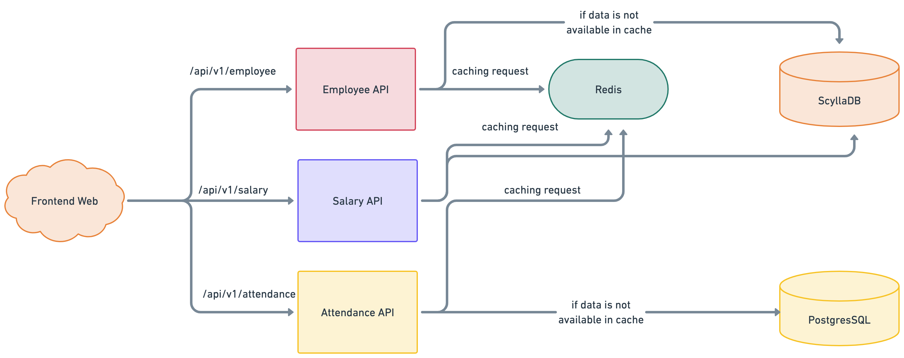

<p align="center">
  
</p>

Frontend Web is a REACTJS based application that is main frontend UI of [OT-Microservices](https://github.com/OT-MICROSERVICES) stack. This application supports cross-platform, the only thing will be required to run this application is javarscript runtime modules.

Supported features of the application are:-

- ReactJS based web framework for the complete web page based operations
- Test case integration for application functionality verification

## Pre-Requisites

The frontend application have dependencies on other REST API of [OT-Microservices](https://github.com/OT-MICROSERVICES). To run the application successfully, we need these things configured:

- [Employee API](https://github.com/OT-MICROSERVICES/employee-api)
- [Attendance API](https://github.com/OT-MICROSERVICES/attendance-api)
- [Salary API](https://github.com/OT-MICROSERVICES/salary-api)

## Architecture



## Application

For building the application, we can use make command with our Makefile. But as first and foremost step, we need to install all the dependencies and packages using `npm`. We can simple use make command for it.

```makefile
make build
```

For building the docker image artifact of the frontend web, we can invoke another make command.

```makefile
make docker-build
```

## Contact Information

[Opstree Opensource](opensource@opstree.com)
